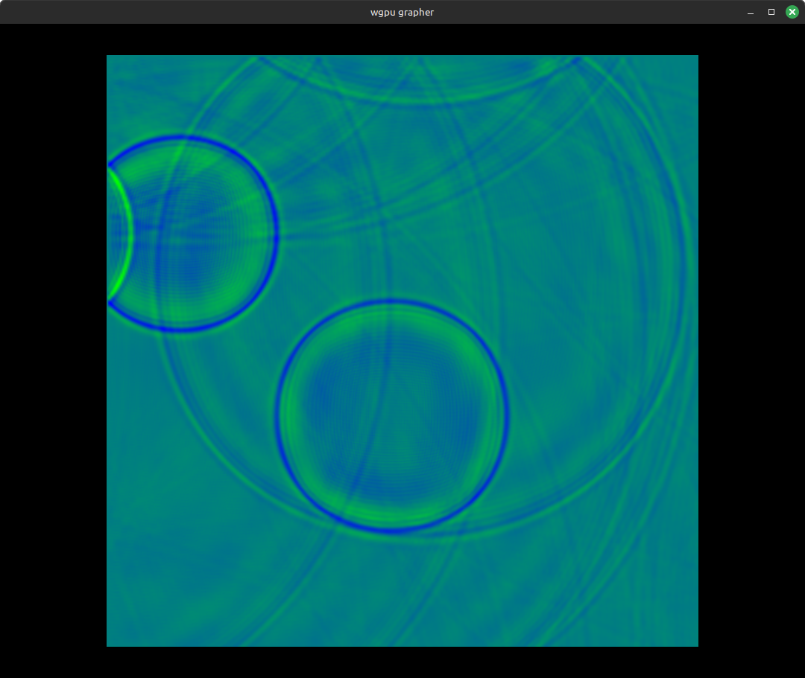
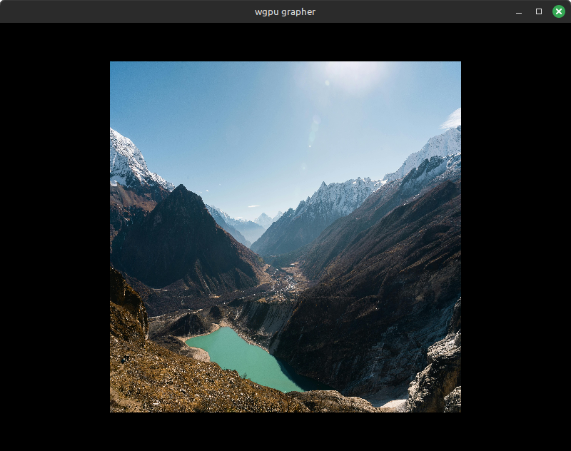

# WGPU Grapher

This is a hobby project to make a 3D rendering engine in Rust using WGPU. It is a work in progress
for learning and (mostly) for fun. I started learning WGPU by following the _Learn WGPU_
tutorial.

There are definitely many things I'd like to do to build on and improve what is here.

## 3D function grapher

The initial feature is a 3D function grapher that draws the graph of a function that
is specified in the code. It can graph pretty much any numerical function `z = f(x, y)` that you can define
in Rust,
but eventually I'd like to add a mathematical expression parsing library and a GUI that allows
the user to type in a function for it to graph.

__Example__:

	

It has two main parts: A simple rendering engine to render a
vector of meshes with solid colored or textured primitives; and code to generate
the meshes for rendering a function graph.

The designs of the camera controller and main event
loop were inspired by the _Learn WGPU_ tutorial.

### Key controls:

| key     | action       |
| :------ | :------:     |
| `left`  | rotate left  |
| `right` | rotate right |
| `up`    | rotate up    |
| `down`  | rotate down  |
| `z`     | zoom in      |
| `x`     | zoom out     |
| `p`     | pause/resume state updates |
| `esc`   | exit         |

## 2D wave equation simulation

It also includes a "real-time" finite-difference simulation of the 2D wave equation.

	

The idea for the random disturbances and energy damping in this simulation
came from [Beltoforion](https://beltoforion.de/en/recreational_mathematics/).
(His work is awesome; it's definitely worth checking out.)

It can also render the wave equation simulation into a texture on a 2D canvas.

	

This looks similar to Beltoforion's example referenced above.

## Image viewer

There is an image viewer mode that renders an image from a file on a canvas
that can be zoomed and rotated, as in the other modes.

	

(Sample image credit to Arjay Neyra on [Pexels](https://www.pexels.com/photo/spectacular-himalayan-mountain-valley-in-nepal-32225792/).)

In the future this will be used for some image processing and further animated simulation applications.
