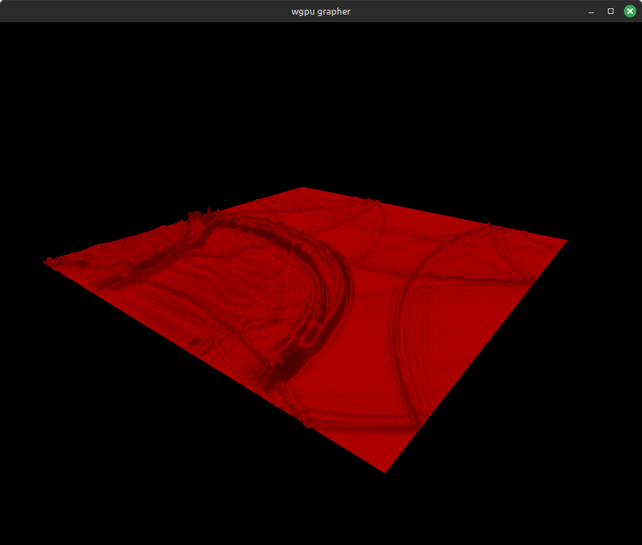

# WGPU Function Grapher

This is a 3D function grapher written in Rust using WGPU.

__Example__ $y = \text{sinc}(\sqrt{x^2 + y^2})$:

	

It has two main parts: A simple rendering engine to render a
vector of meshes with solid colored vertices; and code to generate
the meshes for rendering a function graph.

The designs of the camera controller and main event
loop were inspired by the _Learn WGPU_ tutorial.

### Key controls:

| key     | action       |
| :------ | :------:     |
| `left`  | rotate left  |
| `right` | rotate right |
| `up`    | rotate up    |
| `down`  | rotate down  |
| `z`     | zoom in      |
| `x`     | zoom out     |
| `esc`   | exit         |

## 2D wave equation simulation

It now includes a finite-difference simulation of the 2D wave equation.

	

The idea for the random disturbances and energy damping in this simulation
came from [Beltoforion](https://beltoforion.de/en/recreational_mathematics/).
(His work is awesome; it's definitely worth checking out.)
